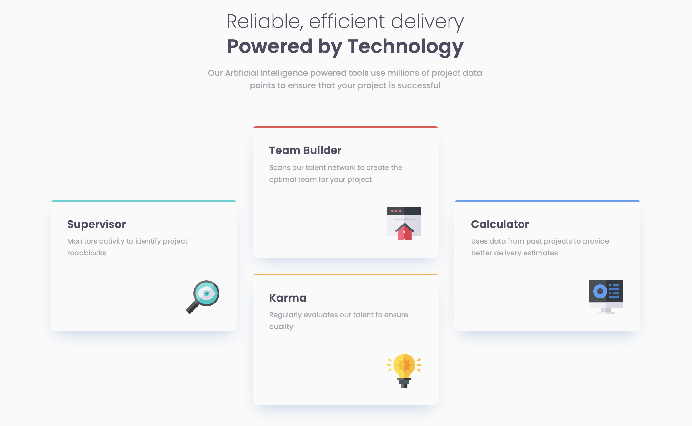

# Frontend Mentor - Four card feature section solution

This is a solution to the [Four card feature section challenge on Frontend Mentor](https://www.frontendmentor.io/challenges/four-card-feature-section-weK1eFYK). Frontend Mentor challenges help you improve your coding skills by building realistic projects. 

## Table of contents

- [Overview](#overview)
  - [The challenge](#the-challenge)
  - [Screenshot](#screenshot)
  - [Links](#links)
- [My process](#my-process)
  - [Built with](#built-with)
  - [What I learned](#what-i-learned)
- [Author](#author)


**Note: Delete this note and update the table of contents based on what sections you keep.**

## Overview

### The challenge

Users should be able to:

- View the optimal layout for the site depending on their device's screen size

### Screenshot




### Links

- [Solution URL](https://github.com/edpau/fm_four-card-feature-section)
- [Live Site URL](https://edpau.github.io/fm_four-card-feature-section/)

## My process

### Built with

- Semantic HTML5 markup
- CSS Grid
- CSS BEM
- Mobile-first workflow


### What I learned

#### Color Banner on each card

Instead of using-border, I learned form @MikDra1

- **Create a Wrapper Element for Each Card**: Ensure each card is positioned relatively. This allows for absolute positioning of child elements.

- **Add a Decorative Element for the Line**: Inside each card, create an additional element (e.g., `<div class="line"></div>`).

- **Style the Decorative Element**:
  - Set the `position` to `absolute`.
  - Apply the following styles:
    - `height: 3px;`
    - `width: 100%;`
    - `top: 0;`
    - `left: 0;`
    - `background-color: [desired color];` (e.g., `black`)

- **Positioning and Sizing**:
  - Ensure the card has `position: relative;` to serve as a reference point for the absolute positioning of the decorative element.

- **Alternative with Pseudo-Elements**:
  - If preferred, use `::before` or `::after` pseudo-elements to create the line:
    ```css
    .card {
      position: relative;
    }

    .card::before {
      content: "";
      position: absolute;
      height: 3px;
      width: 100%;
      top: 0;
      left: 0;
      background-color: [desired color];
    }
    ```

This approach ensures that each card has a straight line at the top, and the use of relative and absolute positioning keeps the layout organized and consistent.


## Author

- Website - [Edward Pau](https://www.edpau.me)
- Frontend Mentor - [@edpau](https://www.frontendmentor.io/profile/edpau)


